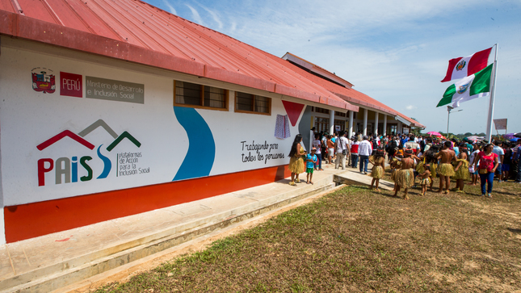

# Tambos_MIDIS_Peru
Web scraping de la página del programa [PAIS](https://www.pais.gob.pe/webpais/public/) para obtener información de los 483 [Tambos](https://www.pais.gob.pe/webpais/public/plataformas/fijas?filtro=&pag=1) a nivel distrital del Perú. 

## Descripción del programa 

El **Programa Nacional Plataformas de Acción para la Inclusión Social - PAIS** es creado en el 2017 (Decreto Supremo 013-2017-MIDIS) sobre la base del Programa Nacional Tambos que fue creado en el 2013 (Decreto Supremo 016-2013-VIVIENDA).

Dirigido a mejorar la calidad de vida de la población en condición de pobreza y pobreza extrema, especialmente la asentada en los centros poblados rurales o rurales dispersos de la Sierra y Selva, coadyuvando a su desarrollo económico, social y productivo que contribuyan a su inclusión social.  

Cuenta con dos modalidades de intervención para brindar servicios y realizar actividades:  
* **Modalidad fija:** A través de **TAMBOS**.  
* **Modalidad móvil, fluvial y terrestre:** A través de Plataformas Itinerantes de Acción Social - PIAS.

## Carpetas 
 📁 [01_codes](https://github.com/braulio-arteaga/Tambos_MIDIS_Peru/tree/main/01_codes):   Contiene el notebook que realiza el web scraping respectivo.    
 📁 [02_output](https://github.com/braulio-arteaga/Tambos_MIDIS_Peru/tree/main/02_output): Contiene la información obtenida de los Tambos (departamento, provincia, distrito, etc.) en un archivo excel.

## Requisito   
* Instalar los paquetes:  `Pandas`, `Selenium` y `Webdriver_manager`  

## Uso del código
* **PASO 1:** Descargar el repositorio.  
* **PASO 2:** Modificar la ruta de exportación.
* **PASO 3:** Ejecutar el notebook.

 📬 Escríbeme a mi correo **marden.arteaga@unmsm.edu.pe** para cualquier duda/problema/sugerencia con este repositorio.  
 
